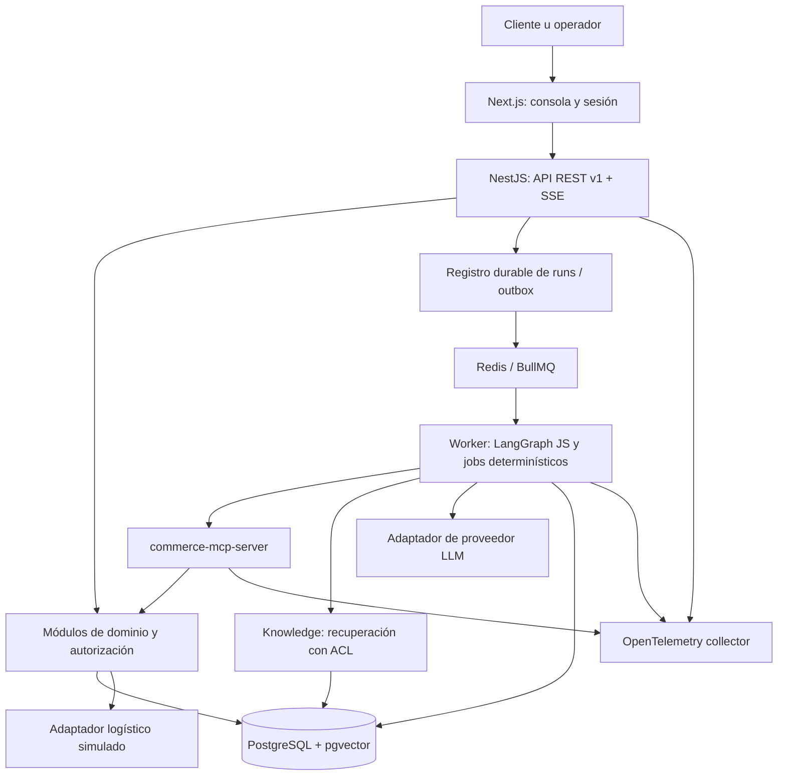

# Arquitectura del MVP

Documento vivo. Se originó en el change `define-commerce-ops-mvp` (archivado tras M0); cada change de milestone registra aquí las decisiones transversales que modifique.

## Context

MVP de portfolio con prácticas cercanas a producción, datos sintéticos y tres workflows completos. Las decisiones siguientes son propuestas concretas para implementar después de esta fase. Supuestos: USD, español, región logística única, usuarios customer/support/inventory/approver/admin y dos tenants de prueba. Identidad mediante OIDC; el rol admin no implica permiso para aprobar órdenes.

## Goals / Non-Goals

Demostrar ingeniería full stack, contratos, RAG, MCP, agentes, seguridad y operación cloud. Priorizar un flujo trazable sobre autonomía abierta. Las exclusiones funcionales están en [alcance del MVP](mvp-scope.md).

## Decisions

### 1. Bounded contexts y ownership

| Contexto | Agregados y responsabilidad | Contratos hacia otros contextos |
|---|---|---|
| Catalog | Product, SKU, atributos tipados, precio vigente y contenido enriquecido | Consultas de productos elegibles; ProductChanged |
| Inventory | Warehouse, StockBalance, Reservation, StockMovement, Anomaly | Disponibilidad/reserva; InventoryChanged, AnomalyDetected |
| Orders | Order, OrderItem, transiciones y snapshot comercial | Detalle y solicitud de cancelación; OrderChanged |
| Fulfillment | Fulfillment, Shipment, TrackingEvent; frescura logística | Estado por paquete y línea; ShipmentUpdated |
| Customers | Customer y relación con identidad autenticada | Perfil mínimo y ownership; no exportación masiva |
| Support | Ticket y reglas de escalamiento | Apertura idempotente, seguimiento, evidencia vinculada |
| Knowledge | Document, versión, chunks, ingesta y vigencia | Recuperación con ACL, región, idioma y citas |
| AI Operations | AgentRun, checkpoint, evidencia, routing y presupuestos | Orquesta contratos; no posee reglas de negocio |
| Access & Governance | Membership, Approval, Audit, ActionRequest | Autorización y decisiones verificadas por servidor |

Recommendations es una capacidad de composición de Catalog, Inventory y Knowledge, no un nuevo dueño del producto. Cada módulo escribe sólo sus tablas. El monolito permite transacciones coordinadas por servicios de aplicación sin saltarse invariantes de otros módulos. Las proyecciones de lectura pueden combinar SQL documentado; no crean un segundo dueño del dato.

### 2. Topología

Monorepo TypeScript con `apps/web`, `apps/api`, `apps/worker`, `apps/commerce-mcp-server`, `packages/contracts`, `packages/domain`, `packages/ai`, `packages/telemetry`, `evals` e `infra`; generado en M0 según la decisión 6. NestJS aplica módulos y servicios de aplicación compartidos entre entradas REST/MCP; ningún agente recibe acceso SQL. OpenAPI y schemas JSON versionados evitan contratos divergentes.

Next.js App Router sobre React facilita consola, vistas de servidor y sesión; React SPA también sería viable, pero implicaría configurar routing y frontera de sesión aparte. Client Components sólo para interacción, streaming y aprobaciones. NestJS mantiene toda autoridad de negocio. La documentación oficial distingue estas fronteras de [servidor y cliente](https://nextjs.org/docs/app/getting-started/server-and-client-components).

PostgreSQL contiene dominio, auditoría, aprobaciones, checkpoints y outbox. Redis sólo cachea y coordina jobs/rate limits; no conserva la única copia de un workflow o aprobación. BullMQ encaja con el [soporte de colas NestJS](https://docs.nestjs.com/techniques/queues). Un dispatcher reconcilia outbox con jobs, con entrega al menos una vez y consumidores idempotentes. Un reinicio de Redis no pierde decisiones: la BD permite reconstruir trabajo pendiente.

### 3. IA y alternativas

LangGraph JS permite checkpoints e interrupciones; se usará un grafo explícito y pequeño, con estado durable en PostgreSQL. Un workflow propio basado en máquina de estados sería más simple para tres casos, pero LangGraph aporta experiencia demostrable de orquestación. No garantiza efectos externos exactamente una vez: cada comando requiere idempotencia independiente. Véase [modelo de ejecución de LangGraph JS](https://docs.langchain.com/oss/javascript/langgraph/thinking-in-langgraph).

OpenAI y Anthropic se compararán en M6 con el mismo dataset, salida estructurada, latencia, tokens y costo. El adaptador será neutral; modelo, versión de prompt y modelo de embeddings se fijarán antes de medir. No se presupone ganador ni paridad de herramientas. Un cambio de proveedor exige reeval; no habrá fallback silencioso de modelo para autorizar acciones. Esta entrega no selecciona IDs comerciales ni contrata servicios.

Supervisor = router + scheduler determinístico y clasificador acotado cuando haga falta. No decide precios, SLA, stock, identidad o permisos mediante lenguaje natural. Los detalles de especialistas están en [agentes y seguridad](agents-security-mcp.md).

### 4. Interfaces y ejecución

API prevista: GET `/v1/products`, `/products/:id`, `/inventory/:sku`, `/orders/:id`, `/orders/:id/fulfillments`, `/orders/:id/shipping`, `/customers/:id`; POST `/v1/agent-runs`; GET `/v1/agent-runs/:id` y `/events` vía SSE; GET `/v1/anomalies`; POST `/v1/support-tickets`; POST `/v1/action-requests`; POST `/v1/approvals/:id/decision`; POST `/v1/orders/:id/actions`. Todos bajo `/v1`, con scopes por endpoint; no existe PATCH genérico de orden.

Crear run devuelve 202 + run_id; SSE transporta estado, citas y decisiones, nunca razonamiento interno. Reconexión consulta estado durable y último event_id. Errores estables: VALIDATION_ERROR, NOT_FOUND, FORBIDDEN, CONFLICT, APPROVAL_REQUIRED, DEPENDENCY_UNAVAILABLE, BUDGET_EXCEEDED. NOT_FOUND uniforme oculta recursos ajenos. Las respuestas de hechos incluyen observed_at/source/version; las listas usan cursores y máximo 50 elementos.

Una acción usa `Idempotency-Key`, scope por tenant/sujeto/comando y hash del payload; repetir con igual payload devuelve el resultado, con payload distinto devuelve CONFLICT. Orden y stock tienen version para concurrencia optimista. Outbox, mutación y auditoría del efecto comparten transacción. Workers reclaman trabajo con lease y reintentos limitados; trabajos agotados pasan a estado de fallo visible y revisión.

### 5. Cloud y observabilidad

Destino propuesto: contenedores en AWS ECS/Fargate, PostgreSQL administrado con pgvector, Redis administrado, almacenamiento de documentos en S3, secretos en Secrets Manager y trazas OpenTelemetry hacia un backend compatible. Antes de provisionar en M11 se comprobarán región, soporte de extensiones, cuotas y presupuesto; no se asume disponibilidad ni precio. Entorno local previsto con contenedores equivalentes, sin Kubernetes.

API/web detrás de TLS; PostgreSQL/Redis privados; worker/MCP sin entrada pública general; egress limitado a OIDC, proveedor IA y servicios necesarios. Imágenes inmutables, migraciones expand/contract, backups y restauración ensayada. Rollback de aplicación compatible con schema anterior; una migración destructiva requiere change separado.

Trazas correlacionan request_id, run_id, tool_call_id, action_id y versión de política. Logs estructurados redactan PII y prompts. Métricas de colas, frescura, errores, aprobaciones, retrieval, tokens y latencia distinguen ejecución activa de espera humana. No se almacena chain-of-thought: sólo entradas mínimas, evidencia, códigos de decisión y resultados.

### 6. Revisión de diseño previa a M0 (2026-09-29)

Revisión enfocada en lo que bloquea el bootstrap. Versiones consultadas en npm y Docker Hub el 2026-09-29; todas se fijan exactas (`save-exact`) con `pnpm-lock.yaml`. Ninguna decisión cambia comportamiento ni alcance funcional.

**Coherencia revisada.** El diseño, docs/ y specs son consistentes en fuentes de verdad, clasificación de tools, estados y gates. Hallazgos resueltos aquí: (a) "servicios compartidos entre REST/MCP" con MCP en proceso propio se concreta en servicios de aplicación framework-agnósticos en `packages/domain`, consumidos por `apps/api` y `apps/commerce-mcp-server`; ningún proceso llama a otro para obtener reglas de negocio; (b) el `request_id` del diseño se materializa como `correlation_id`; (c) faltaba ubicación para bootstrap compartido de logs/trazas, se agrega `packages/telemetry`. Hallazgo pendiente: el escenario "Documentation-only delivery" de evaluation-observability describe la primera entrega y debe reformularse antes de archivar, porque como requisito permanente contradice un sistema implementado.

| # | Tema | Decisión | Justificación |
|---|---|---|---|
| 1 | Gestor y workspaces | pnpm 12.4.2 (`packageManager`), workspaces `apps/*`, `packages/*`, `evals`; `pnpm -r` topológico, sin Turborepo | node_modules estricto impide dependencias fantasma y refuerza boundaries; un lockfile; con 9 paquetes la caché de Turborepo no compensa otra herramienta. Reconsiderar si CI supera 10 min. `minimumReleaseAge: 1440` impide fijar versiones con menos de 24 h publicadas; por eso NestJS, typescript-eslint y Redocly quedan en la versión estable anterior a la última; scripts de instalación denegados salvo lista explícita |
| 2 | Runtime | Node 22.23.1 (`.nvmrc`, `engines ^22.23.1`, `engine-strict`) | Versión instalada y usada por proyectos vecinos; cumple mínimos de Vitest 5, ESLint 10 y Next 16. Evaluar Node 24 LTS en un change propio antes de M11 |
| 3 | Lenguaje y módulos | TypeScript 6.0.3, `strict` + `noUncheckedIndexedAccess`; ESM en todo el repo (`"type": "module"`, `NodeNext`) | NestJS 12 y LangGraph JS se publican sólo como ESM. TypeScript 7.0.2 descartado: typescript-eslint 8.70 exige `<6.1` y no está verificada la metadata de decoradores que NestJS necesita |
| 4 | Web | Next.js 16.3.6, React 19.3.0, App Router | Confirma la elección previa; en M0 sólo una página de estado y un route handler de diagnóstico, sin vistas de M9 |
| 5 | API | NestJS 12.1.0 sobre Express 5 (`@nestjs/platform-express`); validación con Ajv en vez de class-validator; probes `/healthz` y `/readyz` fuera de `/v1` por ser operacionales, el resto bajo `/v1` | Un único lenguaje de schemas (decisión 8) para REST, MCP y evals |
| 6 | Estructura | `packages/contracts` (schemas, OpenAPI, tipos generados), `packages/domain` (servicios de aplicación y, desde M1, acceso a BD por módulo), `packages/ai` (adaptadores neutrales desde M6), `packages/telemetry` (logger, correlación, OpenTelemetry y servidor de probes), `evals` (paquete `@commerce/evals`), `infra` (Compose y scripts) | Packages no importan apps; `domain` no importa `ai` ni frameworks; reforzado por ESLint. Typecheck y lint resuelven los paquetes internos a su código fuente mediante la condición de export `@commerce/source`, sin build previo; runtime, Next.js y tests consumen `dist` |
| 7 | Persistencia | `pg` 8.23.0 + Kysely 0.29.6; migraciones SQL versionadas, sólo hacia adelante (expand/contract), aplicadas con rol migrator separado; se instalan en M1 | RLS, FKs compuestas, índices parciales, pgvector y `SET LOCAL` por transacción son SQL de primera clase; Prisma los abstrae mal y un ORM que genera diffs puede proponer cambios destructivos que el diseño exige aislar |
| 8 | Contratos | JSON Schema 2020-12 canónico en `packages/contracts/schemas`; OpenAPI 3.1 en `packages/contracts/openapi/v1.yaml` con `$ref` a esos schemas; tipos TS generados (json-schema-to-typescript 16.0.0) con control de drift; validación Ajv 8.20.0; lint Redocly CLI 2.54.3 | Archivos neutrales revisables en diffs, reutilizables por tools MCP (`additionalProperties: false`) y evals; OpenAPI 3.1 comparte dialecto con JSON Schema 2020-12 |
| 9 | Colas y agentes | BullMQ 6.3.9 + ioredis 6.0.0 en M0. Objetivo LangGraph JS 1.4.18, `@langchain/core` 1.2.13 y `@langchain/langgraph-checkpoint-postgres` 1.0.5, instalados y reverificados en 7.3 | El worker de M0 no ejecuta grafos; instalar LangGraph sin uso agregaría superficie sin evidencia |
| 10 | MCP | `@modelcontextprotocol/sdk` 1.31.0 y protocolo 2025-11-25, fijados en M5 (Streamable HTTP sin sesión, enforcement en `@commerce/tools`). En M0 el proceso sólo expone health/readiness, sin endpoint MCP | La spec exige transporte autenticado; un `/mcp` sin autenticación, aun sin tools, la contradiría |
| 11 | Tests | Vitest 5.0.2; los providers NestJS se inyectan con tokens `@Inject` explícitos para no depender de `design:paramtypes`, que esbuild no emite; integración contra PostgreSQL/Redis reales de Compose desde M1; contract tests; smoke; Playwright al llegar a M9; evals fuera de `pnpm test`, sin LLM en CI por defecto | Invariantes y aislamiento se prueban contra la BD real, no con mocks |
| 12 | Calidad | ESLint 10.11.0 flat config + typescript-eslint 8.70.1 (type-checked) + `@next/eslint-plugin-next` 16.3.6; Prettier 3.9.9 | Mismos comandos en local y CI |
| 13 | Observabilidad | pino 10.3.1 (JSON, redacción de headers sensibles); OpenTelemetry API 1.9.1, SDK 2.11.0/0.222.0, exporter OTLP HTTP activo sólo con `OTEL_EXPORTER_OTLP_ENDPOINT`; header `X-Correlation-Id` → campo `correlation_id`, reemplazado si no cumple `^[A-Za-z0-9._-]{8,64}$`; W3C `traceparent` para trazas. Jaeger 2.21.0 local opcional (perfil `tracing`) | Correlación visible aunque no haya backend de trazas; la entrada del cliente no se escribe en logs sin validar |
| 14 | Entorno local | Compose con `pgvector/pgvector:0.8.6-pg17-trixie` y `redis:8.10.2-alpine3.23`, fijadas por digest; puertos host 55432/56379; apps en el host en M0 (imágenes de apps en M11). La extensión `vector` se verifica disponible y se crea en la primera migración de M1 | PG17 reduce riesgo con PostgreSQL gestionado (reevaluar PG18 en 12.1); los puertos altos evitan colisiones con servicios locales |
| 15 | CI | GitHub Actions con acciones fijadas por SHA; job `checks` (install `--frozen-lockfile`, lint, format, build, typecheck, test, contratos, evals harness, OpenSpec 1.11.0 estricto) y job `smoke` (Compose + smoke) | Los mismos scripts de `package.json` que en local |
| 16 | Reportes de evals | Cada resultado lleva `status`: EXPECTED (objetivo sin valor medido), SIMULATED (ejecutado contra un objetivo simulado; nunca latencia/calidad de proveedor real) o MEASURED (ejecutado contra código o infraestructura real, con denominador y entorno) | Aplica la regla de config.yaml y el escenario "Simulated provider benchmark" |

## Risks / Trade-offs

- Un monolito comparte base de datos: boundaries se verifican por imports y ownership; extraer servicios sólo ante necesidad demostrada.
- Una logística simulada no prueba fiabilidad con carriers reales; UI y demo lo indican.
- Checkpoints pueden repetir nodos; el efecto se protege en dominio y BD, nunca por el prompt.
- Datos recuperados pueden inyectar instrucciones; ACL y permisos se aplican fuera del modelo y las fuentes sólo se tratan como evidencia.
- Índices aproximados pueden perder candidatos con filtros; MVP empieza con búsqueda exacta sobre subconjunto SQL, y adopta HNSW sólo después de medir recall y latencia.
- Las evaluaciones sintéticas no prueban rendimiento real; el reporte mantiene datasets, tamaño y limitaciones.

## Migration Plan

Greenfield: M0 crea herramientas y estructura; M1 introduce schema y fixtures versionados. M2–M9 construyen slices del contrato; M10 consolida gates; M11 valida demo. Las evals empiezan en M0/M1, no al final. Cada tarea enlaza requisitos y evidencia. Cada milestone es un change propio que sólo se archiva cuando sus tareas tienen evidencia en su verification.md.

## Open Questions

Embeddings: fijados en M4 (`local-hash-v1`, 384 dimensiones; ver `openspec/changes/archive/*-add-hybrid-retrieval/design.md`); medir un modelo neuronal abierto queda pendiente de autorizar la descarga de pesos. Antes de M6: proveedor/modelo de lenguaje. Antes de M11: región, presupuesto mensual y proveedor OIDC. Valores por defecto de SLA y umbrales son fixtures de demo versionados, no políticas de un comercio real. Estas decisiones no bloquean el diseño y ninguna autoriza aprovisionamiento ahora.

## References

Estructura de change y delta specs basada en [OpenSpec concepts](https://github.com/Fission-AI/OpenSpec/blob/main/docs/concepts.md). Fuentes técnicas consultadas el 2026-09-23; las elecciones arquitectónicas y límites del MVP son decisiones de este proyecto.
