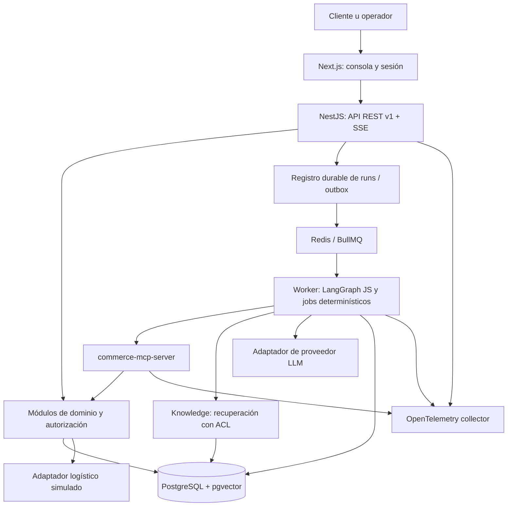

## Context

MVP de portfolio con prácticas cercanas a producción, datos sintéticos y tres workflows completos. Las decisiones siguientes son propuestas concretas para implementar después de esta fase. Supuestos: USD, español, región logística única, usuarios customer/support/inventory/approver/admin y dos tenants de prueba. Identidad mediante OIDC; el rol admin no implica permiso para aprobar órdenes.

## Goals / Non-Goals

Demostrar ingeniería full stack, contratos, RAG, MCP, agentes, seguridad y operación cloud. Priorizar un flujo trazable sobre autonomía abierta. Las exclusiones funcionales están en proposal.md.

## Decisions

### 1. Bounded contexts y ownership

| Contexto | Agregados y responsabilidad | Contratos hacia otros contextos |
|---|---|---|
| Catalog | Product, SKU, atributos tipados, precio vigente y contenido enriquecido | Consultas de productos elegibles; ProductChanged |
| Inventory | Warehouse, StockBalance, Reservation, StockMovement, Anomaly | Disponibilidad/reserva; InventoryChanged, AnomalyDetected |
| Orders | Order, OrderItem, transiciones y snapshot comercial | Detalle y solicitud de cancelación; OrderChanged |
| Fulfillment | Fulfillment, Shipment, TrackingEvent; frescura logística | Estado por paquete y línea; ShipmentUpdated |
| Customers | Customer y relación con identidad autenticada | Perfil mínimo y ownership; no exportación masiva |
| Support | Ticket y reglas de escalamiento | Apertura idempotente, seguimiento, evidencia vinculada |
| Knowledge | Document, versión, chunks, ingesta y vigencia | Recuperación con ACL, región, idioma y citas |
| AI Operations | AgentRun, checkpoint, evidencia, routing y presupuestos | Orquesta contratos; no posee reglas de negocio |
| Access & Governance | Membership, Approval, Audit, ActionRequest | Autorización y decisiones verificadas por servidor |

Recommendations es una capacidad de composición de Catalog, Inventory y Knowledge, no un nuevo dueño del producto. Cada módulo escribe sólo sus tablas. El monolito permite transacciones coordinadas por servicios de aplicación sin saltarse invariantes de otros módulos. Las proyecciones de lectura pueden combinar SQL documentado; no crean un segundo dueño del dato.

### 2. Topología

Monorepo TypeScript con carpetas futuras `apps/web`, `apps/api`, `apps/worker`, `apps/commerce-mcp-server`, `packages/contracts`, `packages/domain`, `packages/ai`, `evals` e `infra`. Es una estructura prevista, aún no generada. NestJS aplica módulos y servicios de aplicación compartidos entre entradas REST/MCP; ningún agente recibe acceso SQL. OpenAPI y schemas JSON versionados evitan contratos divergentes.

Next.js App Router sobre React facilita consola, vistas de servidor y sesión; React SPA también sería viable, pero implicaría configurar routing y frontera de sesión aparte. Client Components sólo para interacción, streaming y aprobaciones. NestJS mantiene toda autoridad de negocio. La documentación oficial distingue estas fronteras de [servidor y cliente](https://nextjs.org/docs/app/getting-started/server-and-client-components).

PostgreSQL contiene dominio, auditoría, aprobaciones, checkpoints y outbox. Redis sólo cachea y coordina jobs/rate limits; no conserva la única copia de un workflow o aprobación. BullMQ encaja con el [soporte de colas NestJS](https://docs.nestjs.com/techniques/queues). Un dispatcher reconcilia outbox con jobs, con entrega al menos una vez y consumidores idempotentes. Un reinicio de Redis no pierde decisiones: la BD permite reconstruir trabajo pendiente.

### 3. IA y alternativas

LangGraph JS permite checkpoints e interrupciones; se usará un grafo explícito y pequeño, con estado durable en PostgreSQL. Un workflow propio basado en máquina de estados sería más simple para tres casos, pero LangGraph aporta experiencia demostrable de orquestación. No garantiza efectos externos exactamente una vez: cada comando requiere idempotencia independiente. Véase [modelo de ejecución de LangGraph JS](https://docs.langchain.com/oss/javascript/langgraph/thinking-in-langgraph).

OpenAI y Anthropic se compararán en M6 con el mismo dataset, salida estructurada, latencia, tokens y costo. El adaptador será neutral; modelo, versión de prompt y modelo de embeddings se fijarán antes de medir. No se presupone ganador ni paridad de herramientas. Un cambio de proveedor exige reeval; no habrá fallback silencioso de modelo para autorizar acciones. Esta entrega no selecciona IDs comerciales ni contrata servicios.

Supervisor = router + scheduler determinístico y clasificador acotado cuando haga falta. No decide precios, SLA, stock, identidad o permisos mediante lenguaje natural. Los detalles de especialistas están en [agentes y seguridad](../../../docs/agents-security-mcp.md).

### 4. Interfaces y ejecución

API prevista: GET `/v1/products`, `/products/:id`, `/inventory/:sku`, `/orders/:id`, `/orders/:id/fulfillments`, `/orders/:id/shipping`, `/customers/:id`; POST `/v1/agent-runs`; GET `/v1/agent-runs/:id` y `/events` vía SSE; GET `/v1/anomalies`; POST `/v1/support-tickets`; POST `/v1/action-requests`; POST `/v1/approvals/:id/decision`; POST `/v1/orders/:id/actions`. Todos bajo `/v1`, con scopes por endpoint; no existe PATCH genérico de orden.

Crear run devuelve 202 + run_id; SSE transporta estado, citas y decisiones, nunca razonamiento interno. Reconexión consulta estado durable y último event_id. Errores estables: VALIDATION_ERROR, NOT_FOUND, FORBIDDEN, CONFLICT, APPROVAL_REQUIRED, DEPENDENCY_UNAVAILABLE, BUDGET_EXCEEDED. NOT_FOUND uniforme oculta recursos ajenos. Las respuestas de hechos incluyen observed_at/source/version; las listas usan cursores y máximo 50 elementos.

Una acción usa `Idempotency-Key`, scope por tenant/sujeto/comando y hash del payload; repetir con igual payload devuelve el resultado, con payload distinto devuelve CONFLICT. Orden y stock tienen version para concurrencia optimista. Outbox, mutación y auditoría del efecto comparten transacción. Workers reclaman trabajo con lease y reintentos limitados; trabajos agotados pasan a estado de fallo visible y revisión.

### 5. Cloud y observabilidad

Destino propuesto: contenedores en AWS ECS/Fargate, PostgreSQL administrado con pgvector, Redis administrado, almacenamiento de documentos en S3, secretos en Secrets Manager y trazas OpenTelemetry hacia un backend compatible. Antes de provisionar en M11 se comprobarán región, soporte de extensiones, cuotas y presupuesto; no se asume disponibilidad ni precio. Entorno local previsto con contenedores equivalentes, sin Kubernetes.

API/web detrás de TLS; PostgreSQL/Redis privados; worker/MCP sin entrada pública general; egress limitado a OIDC, proveedor IA y servicios necesarios. Imágenes inmutables, migraciones expand/contract, backups y restauración ensayada. Rollback de aplicación compatible con schema anterior; una migración destructiva requiere change separado.

Trazas correlacionan request_id, run_id, tool_call_id, action_id y versión de política. Logs estructurados redactan PII y prompts. Métricas de colas, frescura, errores, aprobaciones, retrieval, tokens y latencia distinguen ejecución activa de espera humana. No se almacena chain-of-thought: sólo entradas mínimas, evidencia, códigos de decisión y resultados.

## Risks / Trade-offs

- Un monolito comparte base de datos: boundaries se verifican por imports y ownership; extraer servicios sólo ante necesidad demostrada.
- Una logística simulada no prueba fiabilidad con carriers reales; UI y demo lo indican.
- Checkpoints pueden repetir nodos; el efecto se protege en dominio y BD, nunca por el prompt.
- Datos recuperados pueden inyectar instrucciones; ACL y permisos se aplican fuera del modelo y las fuentes sólo se tratan como evidencia.
- Índices aproximados pueden perder candidatos con filtros; MVP empieza con búsqueda exacta sobre subconjunto SQL, y adopta HNSW sólo después de medir recall y latencia.
- Las evaluaciones sintéticas no prueban rendimiento real; el reporte mantiene datasets, tamaño y limitaciones.

## Migration Plan

Greenfield: M0 crea herramientas y estructura; M1 introduce schema y fixtures versionados. M2–M9 construyen slices del contrato; M10 consolida gates; M11 valida demo. Las evals empiezan en M0/M1, no al final. Cada tarea enlaza requisitos y evidencia. No se archiva el change hasta completar implementación y verificación.

## Open Questions

Antes de M6: proveedor/modelo y dimensión de embeddings mediante spike evaluado. Antes de M11: región, presupuesto mensual y proveedor OIDC. Valores por defecto de SLA y umbrales son fixtures de demo versionados, no políticas de un comercio real. Estas decisiones no bloquean el diseño y ninguna autoriza aprovisionamiento ahora.

## References

Estructura de change y delta specs basada en [OpenSpec concepts](https://github.com/Fission-AI/OpenSpec/blob/main/docs/concepts.md). Fuentes técnicas consultadas el 2026-09-23; las elecciones arquitectónicas y límites del MVP son decisiones de este proyecto.
